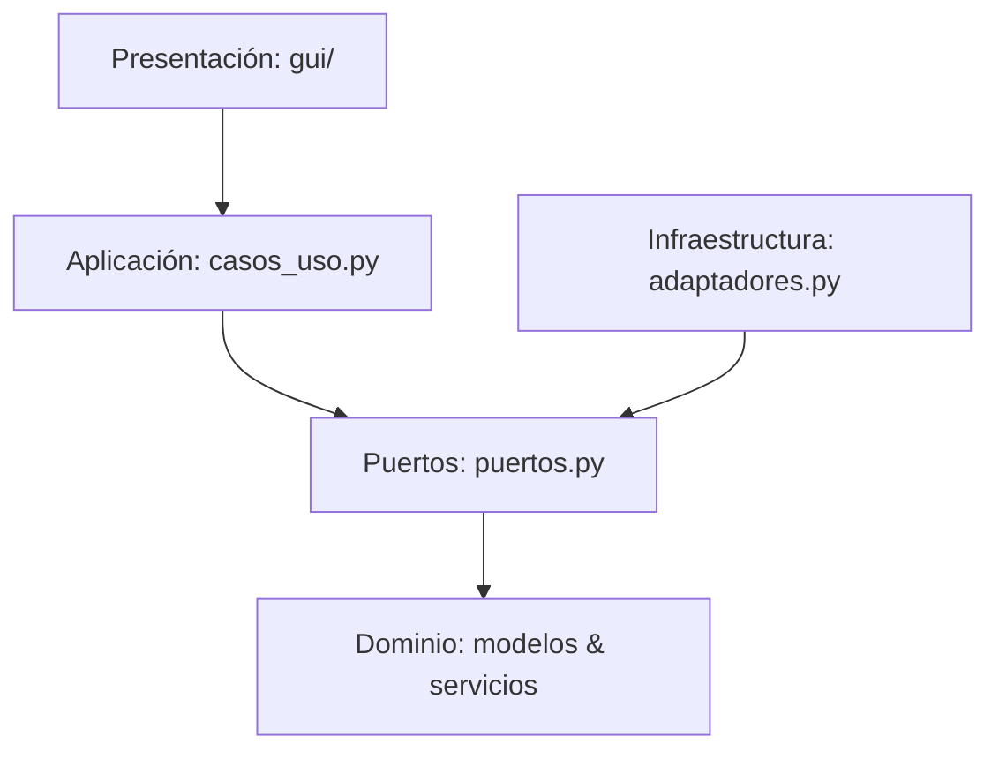

# Sistema de Automatización Archivística

Este documento proporciona una descripción detallada de la arquitectura, el contexto histórico-archivístico y el comportamiento lógico del **Sistema de Automatización Archivística**.

---

## 1. Descripción Contextual del Proyecto

### El Problema Archivístico
En la digitalización de acervos históricos (notariales, parroquiales, gubernamentales), los documentos suelen digitalizarse de manera masiva en un único archivo PDF continuo (por ejemplo, un libro de protocolos notariales completo que contiene cientos de escrituras individuales). 
Paralelamente, los archivistas registran en un inventario de Excel (`.xlsx`) los metadatos de cada documento: el escribano, el número de registro, el título o tipo de escritura, los nombres de los interesados, la fecha de inicio/fin, las observaciones y el **rango de folios** físicos que abarca la escritura.

La separación física del PDF en archivos individuales por documento representa un esfuerzo manual laborioso y propenso a errores humanos. Además, la foliación histórica sigue una notación de **recto/vuelta** (`1r`, `1v`, `2r`, `2v`), y la correspondencia física de las páginas del PDF casi nunca es directa debido a:
1. Páginas de portada o índices iniciales (desfase/offset inicial).
2. Páginas en blanco o insertos que el foliador original no numeró (páginas ignoradas).
3. Hojas dañadas, digitalizaciones duplicadas o saltos en la numeración física (desfases múltiples).

### La Solución
Este software es una **herramienta profesional de procesamiento por lotes (batch processing) y validación de datos**. Vincula el inventario Excel con el archivo PDF digitalizado para:
1. Validar la consistencia lógica de la información en el inventario (sucesión continua de folios, orden cronológico progresivo y coherencia geográfica).
2. Estimar de forma precisa qué páginas del PDF físico corresponden a cada registro, considerando offsets y segmentos personalizados.
3. Extraer automáticamente las páginas correspondientes del PDF principal y guardarlas en una **jerarquía estricta de carpetas de 11 niveles** que refleja la estructura del archivo nacional o histórico.

---

## 2. Arquitectura de Software (Clean Architecture)

El proyecto está diseñado bajo los principios de **Clean Architecture** (Arquitectura Limpia), lo que garantiza que las reglas de negocio estén completamente desacopladas de la interfaz de usuario (Tkinter) y de las librerías de bajo nivel (pandas, openpyxl, pypdf).

### Capas del Sistema:
1. **Dominio (`modules/dominio/`)**:
   - Reglas de negocio puras. No tiene dependencias externas.
   - Contiene la lógica matemática para convertir folios (`r`/`v`) a páginas absolutas, validar progresiones temporales y calcular discrepancias.
2. **Aplicación (`modules/aplicacion/`)**:
   - Define los casos de uso (`CasoUsoFragmentarPdf`, `CasoUsoAnalizarFolios`, etc.).
   - Define los "Puertos" (interfaces abstractas en `puertos.py`) para interactuar con la infraestructura (lectura Excel, extracción PDF, almacenamiento).
3. **Infraestructura (`modules/infraestructura/`)**:
   - Implementa los adaptadores concretos (`RepositorioExcelPandas`, `ServicioPdfPyPdf`, `ServicioAlmacenamientoWindows`).
   - Maneja el acceso al disco, la lectura de celdas con pandas/openpyxl y la manipulación de flujos binarios de PDF con `pypdf`.
4. **Presentación (`modules/gui/` & `gui.py`)**:
   - Interfaz gráfica en Tkinter de estilo Notion (paleta vino/burgundy, tooltips interactivos).
   - Gestiona eventos de selección, configura el rango de trabajo y coordina la ejecución asíncrona mediante hilos de fondo (`threading`) para evitar que la ventana se congele.
5. **Inyección de Dependencias (`modules/contenedor.py`)**:
   - Único punto de ensamble donde se crean los adaptadores y se inyectan en los casos de uso, actuando como el *wiring panel* de la aplicación.

---

## 3. Funcionalidades Lógicas Detalladas

### A. Sistema de Mapeo y Notación de Folios
El núcleo de cálculo del sistema traduce la foliación física a páginas PDF nominales.
- **Notación Recto / Vuelta (`r` / `v`)**:
  - Cada folio (hoja física) tiene dos caras: el anverso (recto, `r`) y el reverso (vuelta, `v`).
  - La fórmula matemática implementada es:
    - $\text{Página Absoluta Recto}(f) = 2 \times f - 1$ (ej. `1r` $\rightarrow$ 1, `2r` $\rightarrow$ 3)
    - $\text{Página Absoluta Vuelta}(f) = 2 \times f$ (ej. `1v` $\rightarrow$ 2, `2v` $\rightarrow$ 4)
- **Cálculo de Rangos**:
  - Soporta folios unitarios (ej. `7r`) y rangos (ej. `4r-6v`).
  - Un rango `4r-6v` abarca desde la página absoluta 7 (`4r`) hasta la 12 (`6v`), generando una lista ordenada de 6 páginas físicas en total.

### B. Gestión de Desplazamientos y Segmentación (Offsets)
El PDF de origen usualmente no empieza en la página absoluta `1`. El sistema cuenta con tres mecanismos para alinear los folios con el PDF físico:
1. **Desplazamiento Base (Offset Principal)**:
   - Permite definir a qué página real del PDF corresponde el folio de inicio configurado (ej. folio `1r` = página `5` del PDF).
   - Genera una traslación lineal de coordenadas para todo el documento: $\text{PagPDF} = \text{PagAbsoluta} - (\text{FolioInicioAbs} - \text{PDFInicio})$.
2. **Segmentación Adicional (Saltos de PDF)**:
   - A veces, el libro físico tiene faltantes o saltos de numeración. El usuario puede registrar múltiples segmentos.
   - Ejemplo: Segmento 1 `1r` $\rightarrow$ Pág PDF `1`, Segmento 2 `401r` $\rightarrow$ Pág PDF `450`.
   - Al mapear un folio, el sistema busca en cuál segmento cae la página absoluta y aplica el desplazamiento correspondiente de manera automática.
3. **Páginas PDF Ignoradas (Exclusiones)**:
   - Permite al usuario designar números o rangos de páginas del PDF (ej. `5, 10-12, 100`) para ser ignorados (por ejemplo, portadillas, hojas en blanco o páginas borrosas).
   - **Algoritmo de Desplazamiento**: Al mapear el rango, si hay páginas ignoradas activas intermedias, las páginas asignadas al documento se desplazan físicamente hacia adelante de forma recursiva, asegurando que el contenido del folio no sea alterado ni se omita información útil.

### C. Analizadores de Consistencia y Calidad de Datos
Antes de ejecutar la fragmentación física, el sistema permite realizar pruebas lógicas sobre la data del inventario para corregir discrepancias en el Excel:

| Analizador | Tipo de Validación Lógica | Comportamiento / Resultado |
| :--- | :--- | :--- |
| **Sucesión de Folios** | Integridad secuencial | Detecta **saltos** (brechas de folios no asignados en las filas), **solapamientos** (dos registros que comparten folios indebidamente) y **folios repetidos** (mismo folio de inicio en filas distintas). Genera sugerencias detalladas de overrides. |
| **Data Tópica** | Geográfica | Valida que los nombres de los lugares tengan caracteres alfabéticos correctos y no contengan valores numéricos erróneos o nulos. |
| **Data Crónica** | Temporal | Valida que las fechas de inicio/fin sigan el formato `d/m/yyyy`, que la fecha fin no sea anterior a la inicial, y que los registros sucesivos muestren un **avance cronológico progresivo** (detecta regresiones en el tiempo). |
| **Cobertura del PDF** | Cuantitativa | Compara el máximo número de página física requerido por el Excel contra el tamaño real del PDF cargado. Informa si sobran páginas en el PDF (`diferencia > 0`) o si el PDF es demasiado corto para los registros especificados (`diferencia < 0`). |

### D. Construcción Estricta de Jerarquías (11 Niveles)
El módulo `ServicioAlmacenamientoWindows` procesa los metadatos de cada fila para construir la ruta física de destino. El sistema sanitiza los nombres para evitar caracteres inválidos del sistema de archivos (`\/:*?"<>|`) y genera una estructura estricta:

1. **`ACERVO DOCUMENTAL NUMERO {num_acervo}`** (ej. extraído de celda "Código del fondo: N7" $\rightarrow$ `7`)
2. **`SIGLO {siglo_arabigo}`** (ej. extraído de "Seccion: XVI" $\rightarrow$ `16`)
3. **`FONDO DOCUMENTAL`** (Texto constante de organización jerárquica)
4. **`{escribano}`** (Nombre del Notario/Escribano sanitizado)
5. **`{año}`** (Año extraído de la fecha inicial del registro)
6. **`PROTOCOLO {protocolo}`** (Número de protocolo)
7. **`REGISTRO {registro_id}`** (ID del registro o escritura)
8. **`{titulo_estandar}`** (Título estandarizado del documento para agruparlo)
9. **`{mes}`** (Nombre estructurado del mes, ej: `1. ENERO`, `2. FEBRERO`)
10. **`{primer_interesado_1}`** (Primer nombre/apellido del primer interesado)
11. **`{primer_interesado_2}.pdf`** (Nombre de archivo final basado en el segundo interesado)

*Manejo de Colisiones:* Si el archivo resultante ya existe físicamente en la jerarquía, el sistema agrega de forma automática un sufijo secuencial (ej. `Interesado_2.pdf` $\rightarrow$ `Interesado_2_2.pdf`) para prevenir sobreescrituras accidentales.

### E. Procesamiento Asíncrono y Tolerancia a Fallos
El caso de uso principal `CasoUsoFragmentarPdf` realiza la separación del archivo:
- **Ejecución en Hilo Secundario**: Ejecuta todo el bucle de procesamiento en un hilo `daemon`. La interfaz gráfica se mantiene fluida y responde a comandos interactivos de cancelación.
- **Overrides de Páginas Exactas**: Si una fila del Excel no sigue la correspondencia matemática (por ejemplo, por repetición de foliación histórica), el usuario puede configurar en el panel de overrides un rango físico forzado para esa fila (ej. Fila `15` $\rightarrow$ Págs PDF `30-31`), puenteando el motor de cálculo.
- **Manejo de Errores y CSV de Pendientes**: Si una fila falla en la validación (fuera de los límites del PDF, folios incoherentes o nulos), el sistema no detiene el lote de trabajo. Registra la fila fallida en un log central `logs/pendientes.csv` detallando el motivo del fallo, incrementa el contador de omitidos y continúa con la siguiente fila.
- **Reporte en Tiempo Real**: Un visor central muestra detalladamente los pasos del mapeo en un bloque de texto que puede ser guardado localmente como bitácora de control de calidad.
